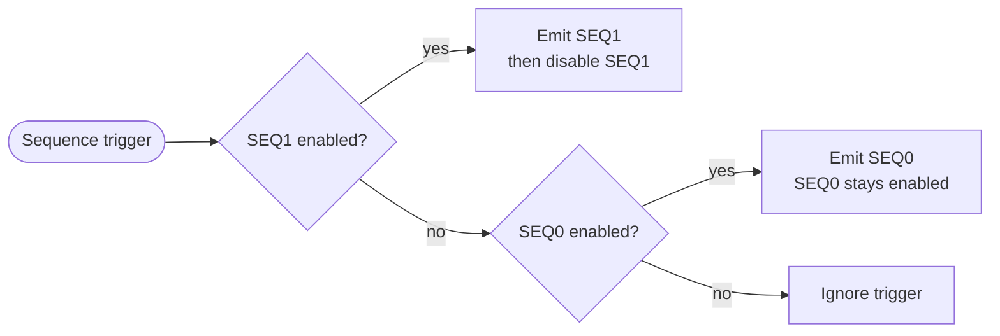
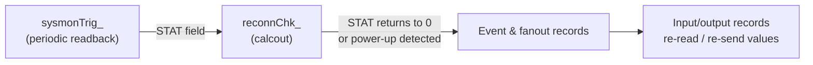

# Dual Event Generator — EPICS Support

> [!NOTE]
> **Docs:** [Hardware](Hardware.md) · [Firmware](Firmware.md) · [EPICS Support](EPICSnotes.md) · [Updating Firmware](HowtoUpdateFirmware.md) · [Bringing Up a New Board](BringingUpNewBoard.md)

## Contents

- [Introduction](#introduction)
- [Database Development](#database-development)
  - [Sequence Waveform Records](#sequence-waveform-records)
  - [Control Records](#control-records)
  - [Latency Measurement](#latency-measurement)
  - [Hardware Triggers](#hardware-triggers)
  - [Software Triggers](#software-triggers)
  - [System Monitor Input Records](#system-monitor-input-records)
  - [Sequencer Status Input Records](#sequencer-status-input-records)
  - [String Input Records](#string-input-records)
  - [Communication Statistics Records](#communication-statistics-records)
  - [FPGA Update on Reconnect](#fpga-update-on-reconnect)
- [IOC Startup Script](#ioc-startup-script)
- [Support Scripts](#support-scripts)

---

## Introduction

This support module and soft IOC provide **ASYN drivers** to control and acquire data from the ALS dual event generator. The module consists of C source, a database, and engineering screens.

The dual event generator provides timing and RF signals for each ALS frequency domain. Each generator produces continuous heartbeat, pulse-per-second, and time-of-day events, as well as sequences of events triggered by assorted conditions.

### Sequence memories

Each generator has two sequence memories, **SEQ0** and **SEQ1**. When a sequence trigger arrives:



### EVG1 — Injector

- Sequences are normally triggered by an FPGA clock running at the injection rate (≈ 0.7 Hz), but can be triggered manually when this clock is disabled.
- **SEQ0** holds the default sequence. It triggers the booster ramp power supplies but **not** the electron gun, linac, or other injection/extraction components. Because SEQ0 stays enabled, it runs continuously — without IOC intervention — while the trigger clock is enabled.
- The timing IOC requests an actual injection cycle by writing the desired sequence to **SEQ1** and enabling it.
- The FPGA provides [status information](#sequencer-status-input-records) so the timing IOC can stay synchronized with the event sequences.
- Trigger requests are delayed until the next **60 Hz power line marker**, then until the next **booster/accumulator ring coincidence**. If the hardware 60 Hz marker is absent, an internal 60 Hz clock is used so the injection cycle isn't held off indefinitely.

### EVG2 — Accumulator and storage rings

EVG2 drives the ALS accumulator and storage rings and their transport lines. IOC sequence trigger requests are delayed until the next **accumulator/storage ring coincidence**, then further by the value of the [`swapoutTrigger`](#control-records) record.

---

## Database Development

The example application ships with a database containing all records below plus EDM screens to display them.

> [!NOTE]
> - All record names begin with the macros `$(P)$(R)`. Only the remainder of each name is shown below.
> - `$(PORT)` expands to the port name given in the [`eventGeneratorConfigure`](#ioc-startup-script) command.
> - Records whose names **end in an underscore** are internal to the IOC — clients should not read or write them.

### Sequence Waveform Records

These records set the pattern and timing of event codes emitted when a sequence is initiated.

```
FTVL = "LONG"
NELM = "2048"
DTYP = "asynInt32ArrayOut"
INP  = "@asyn($(PORT) xxx)"
```

Entries are **`delay:event` pairs**. The delay is the number of transmitter clocks (≈ 8 ns) to wait before emitting the event code. A delay of `0` emits events in adjacent slots.

| Name | Subaddress | Description |
|---|:---:|---|
| `E1:SEQ0` | `0x3000` | EVG1, sequence 0 — default injector sequence. Usually left unwritten since the FPGA loads a default from flash at startup. |
| `E1:SEQ1` | `0x3001` | EVG1, sequence 1 — alternate injector sequence, automatically disabled after being emitted. |
| `E2:SEQ0` | `0x3002` | EVG2, sequence 0 — AR/SR swap-out sequence. |
| `E2:SEQ1` | `0x3003` | EVG2, sequence 1 — not normally used. |

> [!NOTE]
> The FPGA memory blocks hold 28-bit delay values. Delays ≥ 2<sup>28</sup> cycles (≈ 2.1 s) consume multiple memory entries and reduce the number of `delay:event` pairs that fit.

### Control Records

```
DTYP = "asynInt32"
OUT  = "@asyn($(PORT) xxx)"
```

| Name | Subaddress | Type | Description |
|---|:---:|:---:|---|
| `clrPowerup_` | `0x1000` | longout | Part of the [update-on-reconnect](#fpga-update-on-reconnect) mechanism. Clears the FPGA *power up* status. |
| `softTrigger` | `0x1001` | longout | Generate a waveform recorder software trigger when processed. Value is ignored. |
| `INJ:singleShot` | `0x1003` | longout | Generate an injection cycle request when processed. Value is ignored. Effective only when repetitive injection requests are disabled. |
| `Ex:diagOut` | `0x140y` | mbbo | Control EVG *x* (1/2) diagnostic outputs (*y* = 0/1). See [below](#diagnostic-output-modes). |
| `Ex:loopback` | `0x150y` | longout | Crosspoint switch channel to loop back to the FPGA for round-trip latency measurement. Writing causes the matching `Ex:latency` record to process. |
| `FPGA:reboot` | `0x1F00` | longout | Writing `1`, `100`, `10000` in order forces an FPGA reset. |
| `INJ:injCycleEnable` | `0x1F01` | bo | Enable/disable (1/0) injection cycle start requests, which initiate EVG1 SEQ1 if enabled. FLNK to `INJ::forcerbk_`, which processes `sysmonTrig_`. |
| `swapoutTrigger` | `0x1F02` | longout | Generate a swap-out cycle start request (EVG2 SEQ1 if enabled, else SEQ0 if enabled, else ignored). Delayed to the next AR/SR coincidence, then by this many EVG2 clocks. |
| `MGT:Tx:realign` | `0x1F03` | longout | Writing `1`, `10`, `100` in order resets the high-speed serial transmitter and forces realignment. |
| `INJ:extendInterval` | `0x1F046` | ao | Seconds to extend the injection cycle interval. |

#### Diagnostic output modes

Set by the `Ex:diagOut` records:

| State | Output 0 | Output 1 |
|:---:|---|---|
| 0 | Low | Low |
| 1 | High | Low |
| 2 | Low | High |
| 3 | High | High |
| 4 | Transmitter clock (RF/4) | Reference clock (RF/4) |
| 5 | Transmitter clock (RF/4) | Heartbeat marker |
| 6 | Transmitter clock (RF/4) | *Other* generator's heartbeat marker — useful for confirming coincidence |

### Latency Measurement

Processing `Ex:loopback` forces the matching `Ex:latency` record to process.

```
record type: ai
DTYP = "asynInt32"
INP  = "@asyn($(PORT) 0x010y)"   # y = x − 1
```

- Records also process every **10 seconds**.
- The value is the **round-trip time in ns** for a ping from the event generator to the event receiver selected by the crosspoint switches in the event generator and fanout modules.
- The value for a given receiver varies with the amount of buffering in the transceivers.
- Internal helper records `Ex:latencyRb_` are not for client use.

### Hardware Triggers

Set the event code emitted when a hardware trigger input goes from **light to no light** (1 → 0).

| Field | Value |
|---|---|
| Name | `Ee:HW:c` — *e* = 1/2, *c* = 1…5 |
| DTYP | `asynInt32` |
| OUT | `@asyn($(PORT) 0x12xy)` — *x* = 1/2, *y* = 0…4 |

### Software Triggers

Each software trigger is controlled by two longout records:

| Record | Purpose |
|---|---|
| `Ee:SW:c` (*e* = 1/2, *c* = 1…4) | Sets the event code to emit. |
| `Ee:SW:c:trig` | Emits that event code when processed. `DTYP = asynInt32`, `OUT = "@asyn($(PORT) 0x1100)"`, *x* = 1/2, *y* = 0…3. |

### System Monitor Input Records

```
SCAN = "I/O Intr"
DTYP = "asynInt32"
INP  = "@asyn($(PORT) xxx)"
```

Processed via `$(P)$(R)sysmonTrig_`. **All temperatures are in °C.**

#### FPGA and board

| Name | Subaddress | Type | Description |
|---|:---:|:---:|---|
| `FPGA:temp` | `0x2101` | ai | FPGA internal temperature |
| `FPGA:VccINT:V` | `0x2201` | ai | FPGA VccINT supply voltage |
| `FPGA:VccAUX:V` | `0x2102` | ai | FPGA VccAUX supply voltage |
| `FPGA:VccBRAM:V` | `0x2202` | ai | FPGA VccBRAM supply voltage |
| `Marble:PIO_` | `0x2003` | longin | Marble port expanders |
| `Marble:Vin` | `0x2206` | ai | Board supply voltage |
| `Marble:Iin` | `0x2306` | ai | Board supply current |
| `U28:temp` | `0x2319` | ai | Board temperature monitor (U28) |
| `U29:temp` | `0x2419` | ai | Board temperature monitor (U29) |
| `fan1:speed` | `0x2325` | ai | First fan speed |
| `fan2:speed` | `0x2425` | ai | Second fan speed |

#### FMC power

| Name | Subaddress | Type | Description |
|---|:---:|:---:|---|
| `FMC1:V12` | `0x2204` | ai | FMC 1 12 V supply voltage |
| `FMC1:I12` | `0x2304` | ai | FMC 1 12 V supply current |
| `FMC1:V12` | `0x2205` | ai | FMC 2 12 V supply voltage |
| `FMC2:I12` | `0x2305` | ai | FMC 2 12 V supply current |

#### Fiber transceivers

*x* = event generator (1, 2); *y* = transceiver (1, 2, 3).

| Name | Subaddress | Type | Description |
|---|:---:|:---:|---|
| `Ex:Txy:Vcc` | `0x2107, 09, …` | ai | Transmitter supply voltage |
| `Ex:Txy:temp` | `0x2407, 09, …` | ai | Transmitter temperature |
| `Ex:Rxy:Vcc` | `0x2108, 0A, …` | ai | Receiver supply voltage |
| `Ex:Rxy:temp` | `0x2408, 0A, …` | ai | Receiver temperature |
| `Ex:Rxy:enabled` | `0x2113–18` | longin | Bitmap of enabled receivers. Bit 0 = first fiber pair on the cassette, bit 11 = last. |
| `Ex:Rxy:lowPower` | `0x2213–18` | longin | Bitmap of receivers with low input power. Valid only for enabled receivers. |

#### Clock alignment

| Name | Subaddress | Type | Description |
|---|:---:|:---:|---|
| `E1:refCoinc` | `0x211A` | longin | EVG1 reference clock coincidence alignment point |
| `E1:refJitter` | `0x221A` | ai | EVG1 reference clock jitter |
| `E1:txCoinc` | `0x211B` | longin | EVG1 transmitter clock coincidence alignment point |
| `E1:txJitter` | `0x221B` | ai | EVG1 transmitter clock jitter |
| `E1:frequency` | `0x201C` | ai | EVG1 reference clock frequency |
| `E2:refCoinc` | `0x211D` | longin | EVG2 reference clock coincidence alignment point |
| `E2:refJitter` | `0x221D` | ai | EVG2 reference clock jitter |
| `E2:txCoinc` | `0x211E` | longin | EVG2 transmitter clock coincidence alignment point |
| `E2:txJitter` | `0x221E` | ai | EVG2 transmitter clock jitter |
| `E2:frequency` | `0x201F` | ai | EVG2 reference clock frequency |
| `EVG:aligned` | `0x2120` | bi | Both event generators aligned to both RF references |

#### Status

| Name | Subaddress | Type | Description |
|---|:---:|:---:|---|
| `INJ:injCycleCSR` | `0x2121` | longin | Injection cycle control/status register (see below) |
| `TOD:Status` | `0x2022` | longin | Time-of-day source status (see below) |
| `E1:EVIOstatus_` | `0x2123` | longin | EVG1 EVIO raw status (see below) |
| `E2:EVIOstatus_` | `0x2223` | longin | EVG2 EVIO raw status |
| `swapoutStatus_` | `0x2024` | longin | Swap control status. MSB sets when heartbeat misalignment with coincidence is detected. |

<details>
<summary><strong>Status register bit fields</strong></summary>

**`INJ:injCycleCSR`**

| Bits | Meaning |
|---|---|
| 31 | Hardware 60 Hz power line marker invalid (0) / valid (1) |
| 30 | Booster/accumulator bucket alignment coincidence marker unsynchronized (0) / synchronized (1) with heartbeat |
| 23:8 | Injection cycle time in ms, minus two |
| 0 | Injection cycle enabled (0) / disabled (1) |

**`TOD:Status`**

| Bits | Meaning |
|---|---|
| 31:16 | Time-of-day state machine state |
| 1 | Time-of-day seconds invalid (0) / valid (1) |
| 0 | Pulse-per-second signal invalid (0) / valid (1) |

**`Ex:EVIOstatus_`**

| Bits | Meaning |
|---|---|
| 13:8 | Hardware trigger inputs 1–6 (1 = light, 0 = no light) |
| 0 | Diagnostic input state |

</details>

> [!TIP]
> - The EVIO raw status records forward-link to `mbbiDirect` records of the same name **without** the trailing underscore, exposing the individual bits.
> - `INJ:injCycleCSR` forward-links to the `INJ:injCycleEnabled` mbbi record, which tracks its least significant bit.

### Sequencer Status Input Records

```
record: $(P)$(R)Ex:seqStatus   (longin)
SCAN = "I/O Intr"
DTYP = "asynInt32"
INP  = "@asyn($(PORT) 0x010y)"   # x/y = 1/0 or 2/1
```

These records are updated from the FPGA using a **publish/subscribe** technique that minimizes latency between a value changing in the FPGA and the record updating. Record time stamps are set by the FPGA when the status is transmitted.

| Bits | Description |
|---|---|
| 0 | Sequence 0 (default) enabled |
| 1 | Sequence 1 enabled (auto-disabled after emission) |
| 2 | Currently active, or most recently completed, sequence |
| 3 | Event generator is emitting a sequence |
| 4 | Set when a sequence starts. Cleared when the last event is emitted — or, for EVG1, when the event marked in the [default sequence `.csv`](Firmware.md#defaultsequencecsv-format) is emitted. |
| 15–8 | Incremented each time a sequence is triggered — unambiguously detects that a sequence was emitted. |
| 23–16 | Incremented each time a trigger is ignored because a sequence was already active — unambiguously detects overruns. |
| 28–24 | Number of bits in the sequence generator memory address. |

The counter fields guarantee the record value changes (and thus processes) even if the *active* bit (3) toggles faster than the FPGA update rate.

> [!TIP]
> **Detecting a completed sequence:** check that bit 3 is low and that bits 15–8 have changed.

#### Start/finish counters

Each `Ex:seqStatus` record's forward link processes a pair of calc records:

| Record | Increments when… |
|---|---|
| `$(P)$(R)Ex:seqStarts` | The bit selected by the mask in field **B** goes 0 → 1 |
| `$(P)$(R)Ex:seqFinishes` | That bit goes 1 → 0 |

Clients can monitor these to synchronize with the start or end of a sequence.

### String Input Records

Processed on IOC startup and FPGA reconnect.

| Name | DTYP | INP | Description |
|---|---|---|---|
| `firmwareBuildDate` | `asynOctetRead` | `@asyn($(PORT) 0x0000)` | Firmware build date |
| `softwareBuildDate` | `asynOctetRead` | `@asyn($(PORT) 0x0001)` | Software build date |

### Communication Statistics Records

```
record type: longin
DTYP = "asynInt32"
INP  = "@asyn($(PORT) xxx)"
```

| Name | Subaddress | Description |
|---|:---:|---|
| `CmdxRetryCount` | `0xF00x` | Commands acknowledged after *x* retries (*x* = 0…4). Typically `SCAN = "10 second"`. |
| `CmdFailedCount` | `0xF005` | Commands never acknowledged. Typically `SCAN = "10 second"`. |
| `StatConnCount` | `0xF006` | Sequence status subscription successes |
| `StatRecvCount` | `0xF007` | Sequence status monitoring packets received |
| `StatMissedCount` | `0xF008` | Sequence status monitoring packets lost in transit |

### FPGA Update on Reconnect

The IOC automatically restores FPGA settings after an FPGA restart:



---

## IOC Startup Script

FPGA communication is configured at IOC startup with `eventGeneratorConfigure`. Arguments must be in this order:

| # | Argument | Description |
|:---:|---|---|
| 1 | ASYN port name | Arbitrary, but must match the `PORT` used in the `dbLoadRecords` command that loads the database. |
| 2 | IPv4 address | Address of the dual event generator FPGA. |
| 3 | Priority | Port thread priority. `0` gives the default medium priority. |

---

## Support Scripts

Located in `<TOP>/scripts`:

| Script | Purpose |
|---|---|
| `Latencies.py` | Scan all channels and report loopback times. Recurses through fanout modules. |
