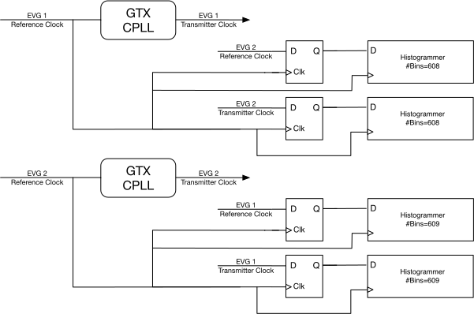
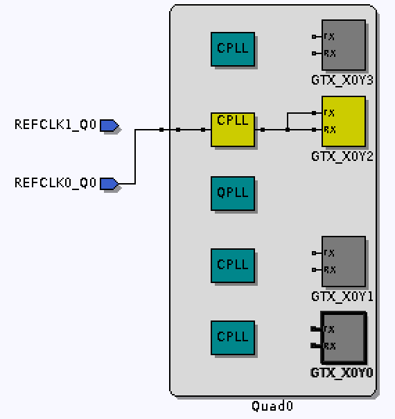
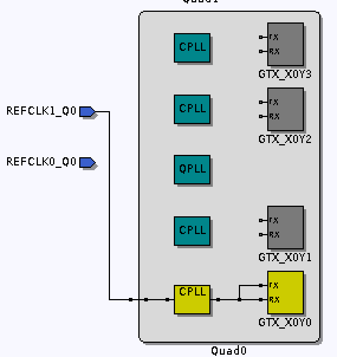

# Dual Event Generator — Firmware

> [!NOTE]
> **Docs:** [Hardware](Hardware.md) · [Firmware](Firmware.md) · [EPICS Support](EPICSnotes.md) · [Updating Firmware](HowtoUpdateFirmware.md) · [Bringing Up a New Board](BringingUpNewBoard.md)

> [!WARNING]
> **ALS test configuration.** To allow testing at the ALS, the FPGA software has been compiled with parameters different from those described in this document, and the entire facility is run from EVG1. To use at ALS-U, restore the definitions in `config.h` to their ALS-U values and rebuild. The values used for ALS testing are:
>
> ```c
> CFG_EVG1_CLK_PER_HEARTBEAT        124640000
> CFG_EVG1_CLK_PER_BR_AR_ALIGNMENT  10250
> ```

To keep the FPGA as responsive as possible to EPICS IOC requests, the firmware provides **two µBlaze processors**:

| Processor | Responsibilities |
|:---:|---|
| 1 | Console, display updates, reading/writing non-volatile memory |
| 2 | EPICS communication — event generator status publisher and event system server |

## Contents

- [Configuration Parameters](#configuration-parameters)
- [Clock Synchronization](#clock-synchronization)
- [Special Event Codes](#special-event-codes)
- [Event Source Precedence](#event-source-precedence)
- [Distributed Data Bus](#distributed-data-bus)
- [Time Providers](#time-providers)
- [TFTP Server](#tftp-server)
- [Setting Network Parameters](#setting-network-parameters)
- [Console Commands](#console-commands)
- [Building](#building)

---

## Configuration Parameters

Configuration parameters shared between the FPGA software and firmware:

| Parameter | Value | Description |
|---|--:|---|
| `CFG_MINIMUM_INJECTION_CYCLE_MS` | 990 | Lower limit on the time (ms) between injection cycle requests. The cycle time is set by the first line of `DefaultSequence.csv`. |
| `CFG_MAXIMUM_INJECTION_CYCLE_MS` | 2010 | Upper limit on the time (ms) between injection cycle requests. |
| `CFG_HARDWARE_TRIGGER_COUNT` | 6 | Number of hardware triggers. |
| `CFG_DIAGNOSTIC_INPUT_COUNT` | 1 | Number of diagnostic inputs. |
| `CFG_DIAGNOSTIC_OUTPUT_COUNT` | 1 | Number of diagnostic outputs. |
| `CFG_SEQUENCE_RAM_CAPACITY` | 1024 | Size of the event sequence RAM. Long intervals between events consume more than one entry, so the actual maximum sequence length may be smaller. |
| `CFG_EVG1_CLK_PER_RF_COINCIDENCE` | 608 | Cycles of the first RF reference clock to return to the same phase offset relative to the second. |
| `CFG_EVG2_CLK_PER_RF_COINCIDENCE` | 609 | Cycles of the second RF reference clock to return to the same phase offset relative to the first. |
| `CFG_EVG1_CLK_PER_HEARTBEAT` | 121296000 | Cycles of the first RF reference clock between heartbeat events on link 1. |
| `CFG_EVG2_CLK_PER_HEARTBEAT` | 124640000 | Cycles of the second RF reference clock between heartbeat events on link 2. |
| `CFG_EVG1_CLK_PER_BR_AR_ALIGNMENT` | 46208 | Clocks between booster and accumulator ring coincidence (clock tree N/E). |

The relationships between the per-generator parameters are:

$$
T_{\text{coincidence}} = \frac{\texttt{CFG\_EVG1\_CLK\_PER\_RF\_COINCIDENCE}}{F_{\text{REF1}}} = \frac{\texttt{CFG\_EVG2\_CLK\_PER\_RF\_COINCIDENCE}}{F_{\text{REF2}}}
$$

$$
T_{\text{heartbeat1}} = \frac{\texttt{CFG\_EVG1\_CLK\_PER\_HEARTBEAT}}{F_{\text{REF1}}}
\qquad
T_{\text{heartbeat2}} = \frac{\texttt{CFG\_EVG2\_CLK\_PER\_HEARTBEAT}}{F_{\text{REF2}}}
$$

where $F_{\text{REF1}}$ and $F_{\text{REF2}}$ are the frequencies of the reference clock inputs, driven at ¼ the rate of the master oscillators for the two frequency domains.

At the nominal storage ring RF of **500.392263 MHz**:

| Quantity | Value |
|---|---|
| Coincidence interval between domains | ≈ 4.868 µs |
| EVG1 heartbeat interval | ≈ 970 ms |
| EVG2 heartbeat interval | ≈ 998 ms |

Note that the two heartbeat intervals are **not** the same.

> [!IMPORTANT]
> If any of these parameters change, run the `createVerilogIDX.sh` script and rebuild both firmware and software.

---

## Clock Synchronization

Each event generator in the FPGA is synchronized to the RF master oscillator driving its part of the accelerator. Each master oscillator is divided by 4 and taken to the FPGA over a fiber link. These reference clocks drive an FPGA transceiver reference PLL and a sampling D flip-flop, as shown below.



The rising edge of the sampled signals indicates the phase of the signal relative to the sampling clock. The sampled values update a histogram whose number of bins equals the number of sample clock cycles in the coincidence interval. Sampling both the transceiver reference and the PLL output gives an accurate measurement of each signal's phase relative to the sampling clock — and, by extension, relative to each other. This determines both the phase at which the PLL locked its output relative to its input, and the point where the PLL output clocks align most closely.

There are two levels of clock alignment:

**1. Transceiver output vs. transceiver reference.**
Each transceiver output clock drives all logic in its event generator. The output can lock at one of twenty possible phase offsets relative to the incoming reference, chosen randomly when the PLL locks. Since random selection is unacceptable here, on startup the transceiver is repeatedly reset until it locks at the desired offset — producing an event stream correctly aligned with its reference.

> [!NOTE]
> The FMC crosspoint switch could momentarily remove the transceiver reference clock as an alternate way to force resynchronization, but this capability is currently unused.

**2. Coincidence between the two RF clock domains.**
The coincidence is the point at which the rising edge of the sampled clock aligns most closely with the rising edge of the FPGA clock, using the D flip-flop sampling logic above. The heartbeat event in each clock domain is aligned with this coincidence.

### Transceiver clock routing

The reference clocks connect to FPGA **bank 115**. The Marble clock crosspoint switch routes:

| Source | Destination |
|---|---|
| `FMC1_GBTCLK0_M2C` (first FMC card) | `MGTREFCLK0_115` |
| `FMC2_GBTCLK0_M2C` (second FMC card) | `MGTREFCLK1_115` |

The third transceiver in the bank drives the first FMC card, and the first transceiver drives the second FMC card.

| EVG 1 | EVG 2 |
|:---:|:---:|
|  |  |

📘 Reference: *7 Series FPGAs GTX/GTH Transceivers User Guide (UG476)*

---

## Special Event Codes

| Code | Hex | Meaning |
|--:|:--:|---|
| 0 | `0x00` | Idle — emitted when no other event code request is present |
| 112 | `0x70` | Shift a **0** bit into the event receiver 32-bit time-of-day shift register |
| 113 | `0x71` | Shift a **1** bit into the event receiver 32-bit time-of-day shift register |
| 122 | `0x7A` | Heartbeat |
| 125 | `0x7D` | Pulse-per-second — copies the time-of-day shift register into the receiver time stamp *seconds* and clears the time stamp *tick* counters |

---

## Event Source Precedence

An event code slot can hold at most one event code, so sources are prioritized. When two or more requests occur simultaneously, the highest priority wins. From highest to lowest:

| Priority | Source | Behavior |
|:---:|---|---|
| 1 | **Sequence pattern** | Never omitted or shifted. *Good practice:* leave at least one empty slot between sequence events to minimize shifting of lower-priority events. |
| 2 | **Heartbeat** | Never shifted. If it collides with a sequence pattern event, the heartbeat request is ignored. |
| 3 | **Pulse-per-second** | Delayed to the first free slot after sequence/heartbeat events. |
| 4 | **Hardware trigger** | Delayed to the first free slot after the above. With multiple triggers, the lowest-numbered input wins. |
| 5 | **Software trigger** | Delayed to the first free slot after the above. |
| 6 | **Time-of-day** (POSIX seconds) | Delayed to the first free slot after all others. Harmless as long as all 32 time-of-day events arrive before the next PPS event. |

---

## Distributed Data Bus

Four distributed data bus bits are used by the event generator firmware:

| Bit | Description |
|:---:|---|
| 0 | Square wave. Rising edge coincides with the heartbeat event (or where it would have occurred had a sequence event not pre-empted it). |
| 1 | 100 kHz square wave used by the round-trip latency measurement firmware. |
| 2 | State of the diagnostic input. |
| 3 | Toggles on each assertion of the PPS hardware input. The corresponding PPS event (125) is delayed from this when pre-empted by a sequence or heartbeat event. |
| 4–7 | Unassigned. |

---

## Time Providers

During normal operation the event generator tracks time by incrementing the POSIX seconds count each time the pulse-per-second marker is asserted. At startup — and whenever the PPS marker resumes after an interruption — it obtains the current POSIX seconds from the selected time provider:

- an **NTP server** on the network, or
- a **GPS receiver** card.

### GPS Time Provider

A Digilent GPS PMOD card can supply the time of day and PPS references required by the dual event generator.

1. Connect the PMOD card to the *odd* side of the Marble **PMOD1** connector (J12 pins 1, 3, 5, 7, 9, 11).
2. Set the NTP server address to `0.0.0.0` (see the [`tod`](#tod) command).

In this mode the FMC PPS input is ignored, and the event generator also acts as a **stratum 1 NTP server**. See [GPS Receiver hardware](Hardware.md#gps-receiver).

---

## TFTP Server

FPGA firmware, system parameters, and the default event sequence are stored in flash memory in a pseudo-filesystem. A TFTP server exposes these "files":

| Name | Description |
|---|---|
| `DEVG_A.bit` | Primary FPGA bootstrap. |
| `DEVG_B.bit` | Secondary FPGA bootstrap. Used if the primary is missing or damaged. |
| `SystemParameters.bin` | Internal representation of the network configuration system parameters. |
| `DefaultSequence.csv` | Default injection sequence (see below). |
| `FullFlash.bin` | The entire 16 MB flash memory. |
| `FMC1_EEPROM.bin` | IPMI EEPROM of the card in the first FMC slot. |
| `FMC2_EEPROM.bin` | IPMI EEPROM of the card in the second FMC slot. |

#### `DefaultSequence.csv` format

This is the sequence generated when the IOC has not requested any other injection sequence, ensuring a valid sequence even if network or IOC issues prevent requests from reaching the FPGA.

- **First line:** time between injection cycle requests, in ms.
- **Following lines:** `delay,event` pairs. Delays are in event generator ticks (≈ 8 ns).
- A third column containing `*` marks the event that clears **bit 4** of the [sequencer status](EPICSnotes.md#sequencer-status-input-records).
- Event code **127** marks the end of the table.

> [!CAUTION]
> - Transfer files in **binary** mode.
> - Don't attempt simultaneous transfers from multiple clients.
> - The filesystem emulation doesn't record the sizes of `.bin` or `.bit` files. Downloading one transfers the full area available, so the result contains the uploaded file followed by extra padding.
> - An IPMI EEPROM can be written only when the **Write Enable** jumper is installed on the FMC card.

---

## Setting Network Parameters

1. Hold the **Reboot/Recovery** button while the system powers up or reboots. This sets:
   - IPv4 address → `192.168.1.129/24`
   - Ethernet MAC → `AA:4C:42:4E:4C:04`
   - NTP server → `0.0.0.0`
2. Connect the chassis to a `192.168.1.0/24` network and run [`console.py`](#support-scripts) from a host on that network.
3. Use the [`mac`](#mac), [`net`](#net), and [`tod`](#tod) commands to set the Ethernet address, IPv4 address, and NTP server address.
4. Reboot or power cycle the system.

> [!TIP]
> Alternatively, use a terminal emulator and USB cable to reach the USB console serial port (115200-8N1) and issue the same commands.

---

## Console Commands

The FPGA sends startup and diagnostic messages to its USB console serial port (115200-8N1) and to a UDP port accessible through [`console.py`](#support-scripts).

The command line interpreter is minimal:

- No command history.
- The only editing is backspace/delete, which erases the last character.
- Carriage return or line feed ends a line.
- Only enough of a command to be unique is required — since no commands share a leading letter, **the first character is enough**.

| Command | Summary |
|---|---|
| [`boot [-b]`](#boot) | Restart the FPGA |
| [`debug [-s] [n]`](#debug) | Set debugging flags |
| [`eyescan [-n] [-r] [n]`](#eyescan) | Show receiver eye diagram |
| [`fmon`](#fmon) | Show FPGA clock frequencies |
| [`log`](#log) | Replay startup messages |
| [`mac [aa:bb:cc:dd:ee:ff]`](#mac) | Show/set MAC address |
| [`net [www.xxx.yyy.zzz[/n]]`](#net) | Show/set network settings |
| [`pll [evg1_target evg2_target]`](#pll) | Show/set PLL target offsets |
| [`reg r [n]`](#reg) | Show GPIO registers |
| [`tod [www.xxx.yyy.zzz]`](#tod) | Show/set NTP server address |

### `boot`

```
boot [-b]
```

Prompts for confirmation, then restarts as if powered up. Boots `DEVG_B.bit` with `-b`, otherwise `DEVG_A.bit`.

### `debug`

```
debug [-s] [n]
```

Sets the debugging flags to `n`, if given. With `-s`, the value is also written to flash and applied at startup.

| Bit | Effect |
|--:|---|
| 0 | Messages related to the EPICS UDP port |
| 1 | Messages related to the TFTP UDP port |
| 2 | Messages related to flash memory I/O transactions |
| 3 | Messages related to the time-of-day state machine |
| 4 | Show GPS receiver sentences |
| 5 | Show sequence memory updates |
| 6 | Display memories for both sequences of both event generators ⚠️ |
| 7 | Show each transceiver's control/status register after a reset control bit change |
| 8 | PLL receiver synchronization state machine messages |
| 9 | Coincidence measurement state machine messages |
| 10 | Show coincidence measurement results |
| 11 | Show coincidence measurement histogram buffers |
| 12 | Log each µBlaze bit-banged I²C operation (MGT clock switch and FMC EEPROMs) |
| 13 | Log each EVIO I²C operation |
| 14 | Log each EVIO I²C register access |
| 15 | Scan the I²C buses and report attached devices |
| 16 | Simulate a press and release of the **Display** button (self-clearing) |
| 24 | Dump the LCD contents to the console as an ASCII portable bitmap ⚠️ |
| 25 | Dump the clock crosspoint switch registers |
| 30 | Reset and realign both event generator transmitters |

> [!WARNING]
> - **Bit 6** inhibits FPGA responses to IOC requests while a sequence is being displayed — don't use it during operations.
> - **Bit 24** takes over a minute, during which no other display or console operations occur.

### `eyescan`

```
eyescan [-n] [-r] [n]
```

Shows the eye diagram for the high-speed receiver of event generator `n` (default 1). A full scan takes several seconds; EPICS communication and event generator operation continue meanwhile.

| Option | Effect |
|---|---|
| `-n` | Show hexadecimal digits — the floor of log₂(errorCount) at each point — instead of ASCII art. Zero-error points still show as space, overflows as `@`. |
| `-r` | Print the error count at each point. |

### `fmon`

Show the frequencies of the various FPGA clocks.

### `log`

Replay console startup messages.

### `mac`

```
mac [aa:bb:cc:dd:ee:ff]
```

Show the Ethernet MAC address, or set it in flash (with confirmation).

### `net`

```
net [www.xxx.yyy.zzz[/n]]
```

Show network settings, or set the network address in flash (with confirmation). The netmask comes from the optional prefix length `/n`, defaulting to 24 (Class C).

### `pll`

```
pll [evg1_target evg2_target]
```

Show — or write to flash — the target offsets between the transceiver PLL output and reference for each event generator. At boot the FPGA resets the transceivers until the offsets match these targets.

> [!IMPORTANT]
> Adjust the targets whenever the firmware is rebuilt, to reflect changes in signal latencies within the FPGA.

### `reg`

```
reg r [n]
```

Show `n` (default 1) general-purpose I/O registers starting at register `r`.

### `tod`

```
tod [www.xxx.yyy.zzz]
```

Show the NTP server IPv4 address, or set it in flash (with confirmation). Set to `0.0.0.0` to use the [GPS receiver](#gps-time-provider) instead.

---

## Support Scripts

### `console.py`

```sh
console.py [-a IP_name_or_address]
```

Connect to the FPGA console port.

---

## Building

### Firmware

1. `cd <TOP>/DualEventGeneratorMarble.srcs/sources_1/hdl/`
2. Run `startVivado.sh` to start the correct Vivado version.
3. Click **Generate Bitstream** in the Project Manager pane.
4. Export the hardware **only if the µBlaze address map has changed**: **File → Export → Export Hardware…**
   1. Select the **Fixed** platform type → **Next**.
   2. Select **Pre-synthesis** output (do *not* export the bitstream) → **Next**.
   3. Confirm the export target is `<TOP>/DualEventGeneratorMarble.xsa` → **Next**.
   4. If warned that the file exists, confirm the overwrite.
   5. Check the options → **Finish**.

### Software

#### After a new hardware specification

Vitis is only needed when Vivado has written a new hardware specification.

1. `cd <TOP>/Workspace/Processor0/scripts`
2. Run `startVitis.sh` (or from Vivado: **Tools → Launch Vitis IDE**).
3. Confirm the workspace is `<TOP>/Workspace` → **Launch**.
4. Right-click **DualEventGeneratorMarblePlatform** in the Explorer pane → **Update Hardware Specification**.
5. Confirm the file is `<TOP>/DualEventGeneratorMarble.xsa` → **OK**.
6. Click **OK** in the completion dialog.
7. **Project → Build All** to build the support libraries and application.
8. Continue with the steps below.

#### After application source changes

```sh
cd <TOP>/Workspace/Processor0/scripts
sh startVitis.sh bash   # shell with Vitis tools on PATH
make
```

> [!NOTE]
> Run `make` even after a Vitis **Build All** — the Makefile ensures the software build date is correct and generates the final `download.bit`.

### USB/JTAG

To download an image or run a ChipScope session over the on-board USB/JTAG, run `ftdiJTAG` to create a Xilinx Virtual Cable.

If the Marble is the only FTDI device connected:

```sh
ftdiJTAG -c 30M -g 11
```

With multiple devices, specify `vendor:product:serial`:

```sh
ftdiJTAG -c 30M -g 11 -d 0403:6011:000004
```

| Argument | Meaning |
|---|---|
| `-c 30M` | Run JTAG at its maximum speed of 30 Mb/s |
| `-g 11` | Enable the Marble on-board USB/JTAG connection |

See `ftdiJTAG(1)` for full details, including connecting Vivado to the virtual cable, and [Bringing Up a New Board](BringingUpNewBoard.md) for a walkthrough.

### Build Scripts

Located in `<TOP>/Workspace/Processor0/scripts`:

| Script | Purpose |
|---|---|
| `programFlash.sh` | Program Marble flash memory from a downloadable bitfile. |
| `pushImage.sh` | Copy `download.bit`, `programFlash.sh`, and `DefaultSequence.csv` to the EPICS support module `<SUPTOP>/head/FPGA` directory on the controls file server. |
| `programEEPROM.sh` | Program the IPMI EEPROM on a mezzanine card mounted on a Marble. **Install the write-enable jumper first.** |
| `create_FMC_EEPROM.sh` | Create IPMI EEPROM images. Edit the script to set the product name and serial numbers before running. |

> [!TIP]
> Use `fru-dump` to inspect an IPMI EEPROM image. The `b`, `c`, and `p` options show board, card, and power requirements respectively.
