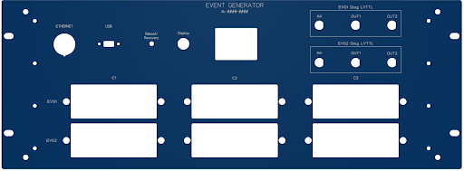
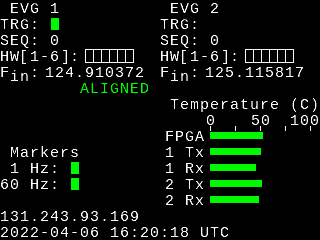
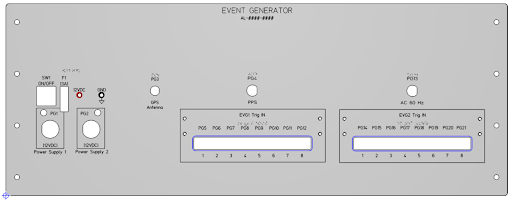
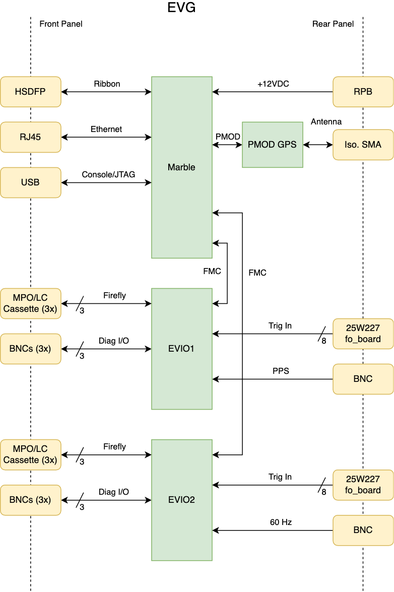
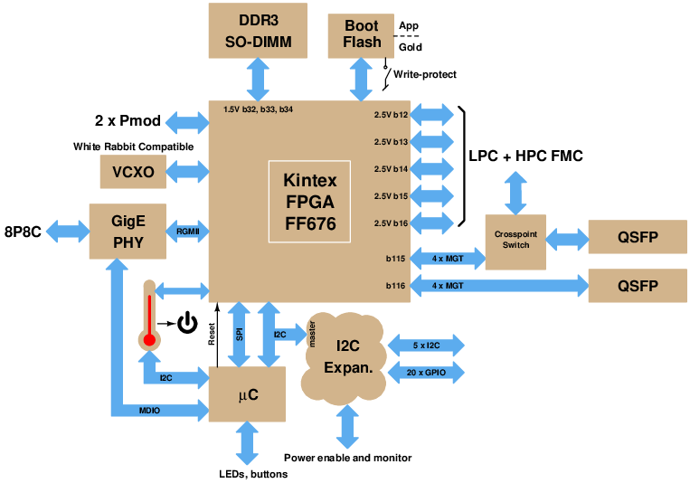
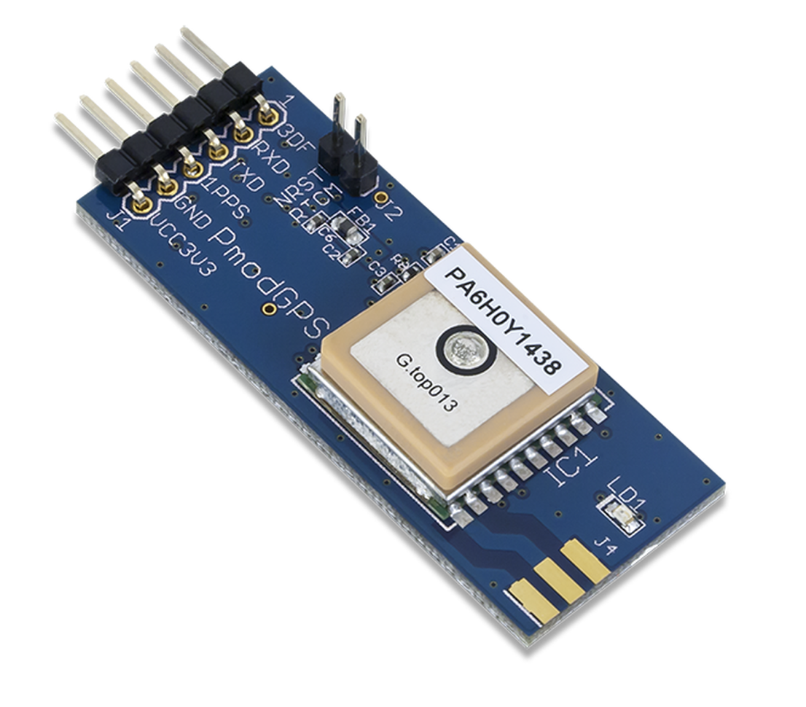

# Dual Event Generator — Hardware

> [!NOTE]
> **Docs:** [Hardware](Hardware.md) · [Firmware](Firmware.md) · [EPICS Support](EPICSnotes.md) · [Updating Firmware](HowtoUpdateFirmware.md) · [Bringing Up a New Board](BringingUpNewBoard.md)

The dual event generator consists of an FPGA platform, two FMC cards, a front panel display, and an optional PMOD card. Each event generator distributes RF reference and timing signals on an optical fiber using a protocol compatible with that used by Micro-Research Finland timing equipment.

The ALS-U project requires two event generators, one for each of the RF frequencies in use. The generators are locked to a common base and ensure coincidence between the two frequency domains. The FPGA can also act as a **stratum 1 NTP server**.

## Contents

- [Front Panel](#front-panel)
  - [Connectors](#front-panel-connectors)
  - [Buttons](#buttons)
  - [Display](#front-panel-display)
- [Rear Panel](#rear-panel)
- [System Architecture](#system-architecture)
  - [FPGA Card (Marble)](#fpga-card-marble)
  - [FMC Cards (EVIO)](#fmc-cards-evio)
  - [GPS Receiver](#gps-receiver)
  - [Display Interface (PMOD2)](#display-interface-pmod2)
  - [USB FTDI Serial Ports](#usb-ftdi-serial-ports)

---

## Front Panel

### Front Panel Connectors

| # | Connector | Purpose |
|---|-----------|---------|
| 1 | RJ-45 | 1000Base-T Ethernet |
| 2 | USB | Console serial port and JTAG interface |
| 3 | BNC | Diagnostic signals |
| 4 | Fiber cartridges | Up to three per event domain, each with 12 dual-LC50 fiber connectors |

### Buttons

#### Display

| Action | Result |
|--------|--------|
| Press and release | Re-enables the backlight for another 20 minutes (it turns off automatically after 20 minutes to extend its lifetime). |
| Momentary press | Cycles to the next display page. |
| Press and hold for 1 s | Clears a warning message and restores the display to its current page. |
| Hold, then press and hold **Reboot/Recovery** for > 1 s | Boots from `DEVG_B.bin` instead of the default `DEVG_A.bin`. |

#### Reboot/Recovery

Pressing and holding this button for more than one second causes the FPGA to perform a power-on reset.

> [!TIP]
> **Recovery mode** — If this button is held down while the FPGA is starting up after a power cycle or reset, the FPGA enters recovery mode with these defaults:
>
> | Setting | Default |
> |---------|---------|
> | Ethernet MAC | `AA:4C:42:4E:4C:04` |
> | IPv4 address | `192.168.1.129/24` |

### Front Panel Display

On startup the front panel display shows the following:

1. **Sequence generator status** (top lines)
   - `TRG:` — the green indicator blinks when an event sequence is triggered.
   - `SEQ:` — number (0/1) of the currently or previously active sequence.
   - `HW:` — hardware trigger inputs, input 1 at the left through input 6 at the right. A green block indicates light is present at the input.
2. **Input reference clock frequencies** (fifth line), in MHz.
3. **Alignment** (sixth line) — `ALIGNED` when both event generators emit heartbeat events aligned to the point at which the RF references are in coincidence; `MISALIGNED` if RF coincidence cannot be measured or the coincidence point has shifted.
4. **Markers** (lower left) — status of the timing marker inputs.
5. **Temperature** — bar indicators for the FPGA and the warmest receiver and transmitter module on each FMC card.
6. **IPv4 address** (penultimate line) — normally white on black. **Black on white indicates recovery mode.**
7. **Date and time** (bottom line), in UTC.

#### Display pages

Press and release **Display** to cycle through:

1. The startup page described above.
2. Event codes emitted by event generator 1. Codes appear as they are emitted and stay on screen for about 0.7 s.
3. Event codes emitted by event generator 2.

#### Special displays

| Appearance | Meaning | How to exit |
|------------|---------|-------------|
| 🟥 Black text on red | Fatal error | Reset or power cycle only |
| 🟨 Black text on yellow | Warning | Press and hold **Display** for 1 s |

---

## Rear Panel

| # | Component | Details |
|---|-----------|---------|
| 1 | Power connectors | For 12 V power adapters |
| 2 | Fuse holder | 3 A slow-blow |
| 3 | On/Off switch | |
| 4 | Test points | Power supply |
| 5 | Isolated SMA | Antenna for the optional [GPS receiver](#gps-receiver) |
| 6 | Broadcom "Versatile Link" fiber receivers | Hardware event triggers. Only the first six of each group of eight are used. **Triggers fire on loss of light.** |
| 7 | Isolated BNC inputs | Timing reference signals. LVTTL compatible, medium impedance (475 Ω plus series LED). Logic-1 threshold ≈ 1.8 V; max input 5.0 V. |

---

## System Architecture

The dual event generator is based on a **Marble** FPGA carrier board and two **EVIO** FMC cards. An optional GPS receiver PMOD card can provide the time reference. The system is enclosed in a 4U rack-mount chassis.

### FPGA Card (Marble)

The FPGA carrier card is a *Marble*, developed by the LBNL Accelerator Technology Group.

| Feature | Details |
|---------|---------|
| FPGA | Kintex-7 (XC7K160TFFG676-2), Open Hardware (OHWR) dual-LPC-FMC carrier |
| Power | Barrel connector (CUI PJ-102AH) or Power over Ethernet |
| Ethernet | 1000Base-T on 8P8C (RJ-45) |
| Transceivers | 8 × GTX, up to 12.5 Gb/s, to QSFP slots and FMC connectors |
| FMC | 2 × LPC-superset connectors with multiple high-speed serial lanes |
| Memory | SO-DIMM SDRAM connector (unused in this application) |
| PMOD | 2 × dual-row (12-pin) 3.3 V — one drives the display, the other connects the optional [GPS receiver](#gps-receiver) |
| Flash | 16 MB SPI, for FPGA and application bootstrap |

### FMC Cards (EVIO)

Each FMC card provides:

- A reference clock to the FPGA gigabit transceiver block and to an FPGA clock input.
- Six hardware trigger inputs, driven by fiber-to-copper converters on another board.
- One optically coupled, TTL-level auxiliary input.
- One non-isolated, TTL-level diagnostic input.
- Two non-isolated, LVTTL-level diagnostic outputs capable of driving 50 Ω loads.
- Up to three 12-channel **Firefly** transceivers for event stream outputs. The first channel of the first transceiver carries the reference clock signal to the card.
- A **40 × 40 crosspoint switch** for flexible routing of event streams and reference clocks between the Firefly modules and the FMC connector.

| Card | Auxiliary input use |
|------|---------------------|
| FMC 1 | Pulse-per-second signal |
| FMC 2 | Power line (60 Hz) monitor signal |

> [!NOTE]
> These FMC cards are also used in the event fanout modules.

### GPS Receiver

A Digilent GPS receiver module can be connected to the Marble **PMOD1 (J12)** connector to provide the absolute time of day and the pulse-per-second marker required for event generator operation. An SMA connector must be soldered to the module and connected through the rear-panel isolated SMA connector to an external antenna.

See [GPS Time Provider](Firmware.md#gps-time-provider) for configuration.

### Display Interface (PMOD2)

The Marble **PMOD2 (J13)** connector connects to the front-panel **Display** and **Reboot/Recovery** buttons and drives a 240 × 320 display with a Sitronix **ST7789V** controller configured for 4-line serial operation.

| PMOD2 line | ST7789V line | Description |
|:---:|:---:|---|
| 0 | CS | Chip select (active low) |
| 1 | SDA | Bidirectional data |
| 2 | — | Backlight driver enable |
| 3 | SCLK | Serial clock |
| 4 | RESET | Reset (active low) |
| 5 | D/C | Command (low) / Data (high) |
| 6 | — | Reboot/Recovery button (active low, on-board pull-up) |
| 7 | — | Display button (active low, on-board pull-up) |

### USB FTDI Serial Ports

| Port | Function |
|:---:|---|
| A | JTAG |
| B | RTS → `LPC_ISPn`, DTR → `ISP_RSTn`. DTR low ("DTR Active") resets the microcontroller. |
| C | FPGA console serial port |
| D | Microcontroller console serial port |

Console serial ports run at **115200-8N1**. Use any terminal emulator to communicate with the FPGA or microcontroller.
