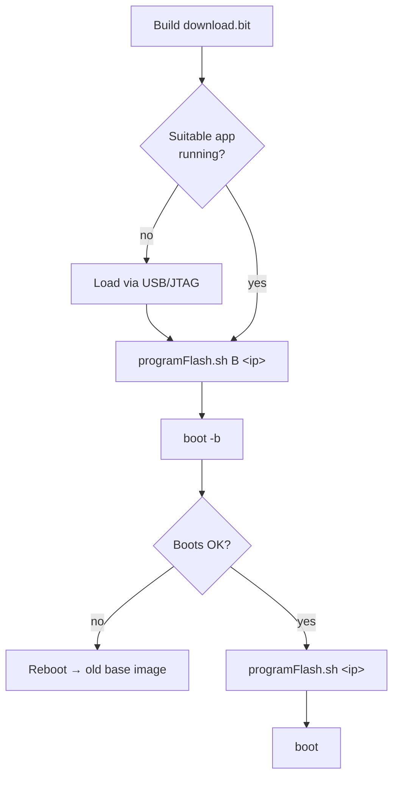

# How to Update Firmware

> [!NOTE]
> **Docs:** [Hardware](Hardware.md) · [Firmware](Firmware.md) · [EPICS Support](EPICSnotes.md) · [Updating Firmware](HowtoUpdateFirmware.md) · [Bringing Up a New Board](BringingUpNewBoard.md)

This procedure creates a bootable image containing FPGA firmware and application software, then transfers it to flash memory.

**Prerequisites:** a Vivado session with the desired project is running.

> [!TIP]
> **Only changed the application software?** Skip to [step 9](#9-build-the-system-project).

> [!WARNING]
> The procedure is made more difficult by some annoying flaws in the Xilinx development tools. Watch for the extra steps called out below.

---

## Part 1 — Export hardware and update the platform

#### 1. Export the hardware

**File → Export → Export Hardware…**

#### 2. Exclude the bitstream

In the **Export Hardware** dialog, make sure **Include bitstream** is *unchecked*, then click **OK**.

#### 3. Open Vitis

Start Vitis and select the `ALSUeventGenerator` workspace.

#### 4. Update the hardware specification

In the project hierarchy, right-click **`ALSUeventGenerator_platform`** → **Update Hardware Specification**.

#### 5. Confirm the `.xsa` file

Check that **Hardware Specification File** refers to `ALSUeventGenerator.xsa`, then click **OK**.

#### 6. Dismiss the completion dialog

Click **OK**.

#### 7. Reset the BSP sources

> [!IMPORTANT]
> This step works around a flaw in the **2019.3** tools.

1. In the platform hierarchy pane, select **Board Support Package**.
2. Click **Reset BSP Sources**.
3. In the confirmation dialog, click **Yes**.
4. In the error dialog that appears shortly after, click **OK**.

#### 8. Build the platform

Right-click **`ALSUeventGenerator_platform`** → **Build Project**.

> [!CAUTION]
> If the progress pane (lower center) shows only a single line like `XSDB Server Channel: tcfchan#1`, the build didn't really run — **go back to [step 4](#4-update-the-hardware-specification)**.

---

## Part 2 — Build the bootable image

#### 9. Build the system project

Right-click **`ALSUeventGenerator_system`** → **Build Project**. Watch progress in the progress pane.

#### 10. Open a Vitis shell

```sh
cd <workspace>/ALSUeventGenerator/src
sh startVitis.sh bash
```

This starts a shell with the environment variables for the Xilinx tools.

#### 11. Make the download image

```sh
cd <workspace>/ALSUeventGenerator/scripts
make
```

This leaves a `download.bit` file in the `scripts` directory.

---

## Part 3 — Program the flash

#### 12. Check that the board is running a suitable application

- ✅ **Yes** → continue with step 13.
- ❌ **No** (new FPGA, or no suitable application running) → use the [USB/JTAG connection](BringingUpNewBoard.md) to download and run the application, then run `programFlash.sh`.

#### 13. Write the *alternate* boot image

```sh
sh programFlash.sh B 131.243.93.169
```

Uses TFTP to transfer `download.bit` to the alternate boot image in flash, then reads it back to confirm the transfer and write succeeded.

#### 14. Boot the alternate image

From the FPGA console:

```
boot -b
```

**Or:** hold **Display**, then press **Reboot/Recovery** for a couple of seconds.

#### 15. Verify

- ✅ **Boots and starts properly** → continue to step 16.
- ❌ **Doesn't** → press **Reboot/Recovery** for a couple of seconds, or power cycle, to reboot the old firmware from the base image.

#### 16. Write the *base* boot image

```sh
sh programFlash.sh 131.243.93.169
```

Transfers `download.bit` to the base boot image and verifies it by read-back.

#### 17. Reboot into the new base image

Any of:

- Run `boot` (no arguments) from the FPGA console.
- Press **Reboot/Recovery** for a couple of seconds.
- Power cycle the unit.

---

## Quick reference


